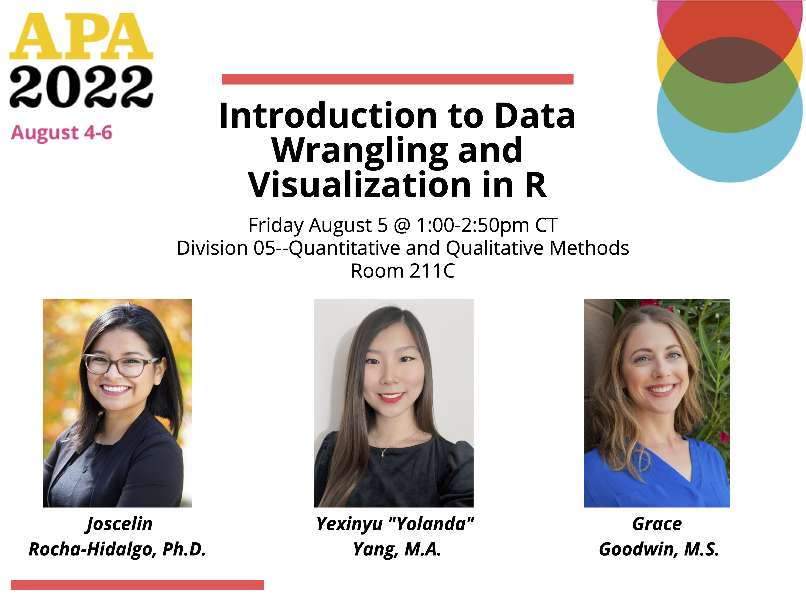

```{r setup, include=FALSE}
knitr::opts_chunk$set(eval = F, 
                      warning = F,
                      message = F)

library(xaringan)
```


class: center, middle

### Download Slides & Exercises from:

.big[#### https://github.com/Joscelinrocha/APA_2022_Intro_to_R_workshop]


### APA Convention WiFi Password: 2022CONV

---

.center[]

---

class: center, middle

### Download Slides & Exercises from:

.big[#### https://github.com/Joscelinrocha/APA_2022_Intro_to_R_workshop]


### APA Convention WiFi Password: 2022CONV

---

.center[]

---

class: center, middle

### Download Slides & Exercises from:

.big[#### https://github.com/Joscelinrocha/APA_2022_Intro_to_R_workshop]


### APA Convention WiFi Password: 2022CONV

