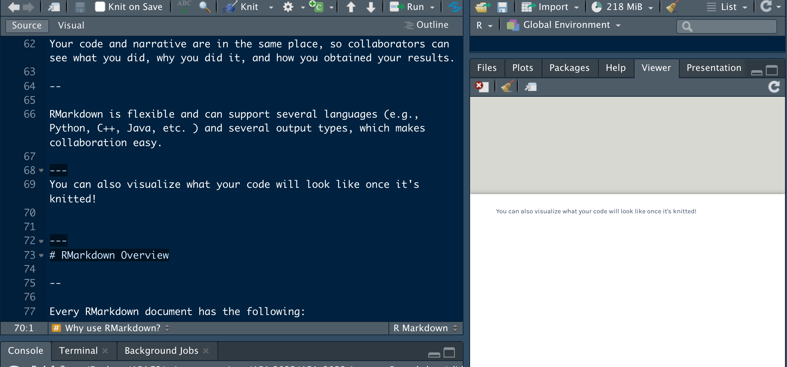
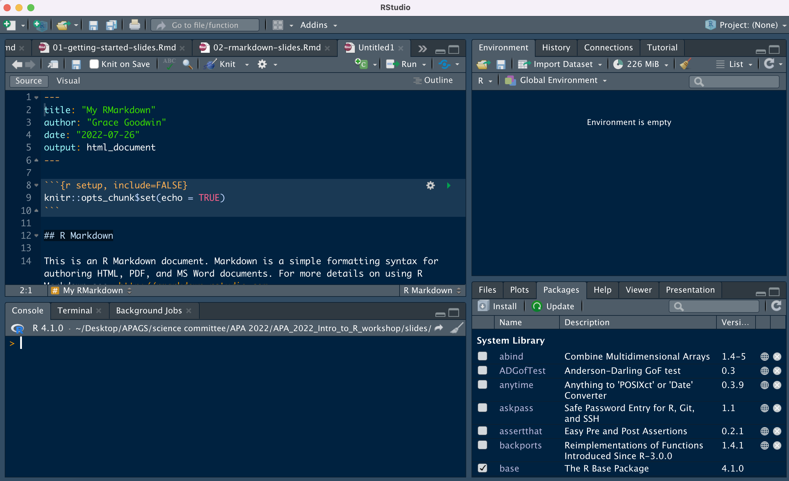
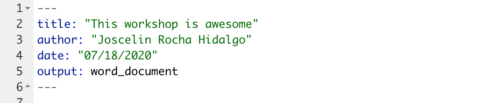
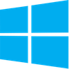

```{r include = FALSE}
#options(htmltools.dir.version = FALSE)
#xaringan::inf_mr()
```

class: center, middle, inverse, dk-section-title

**Slides adapted from David Keyes (@dgkeyes), inspired by Danielle Navarro (@djnavarro) and Paul Campbell (@paulcampbell91)**

---

Art by @allison_horst


---
# What is RMarkdown?

--

Authoring framework for data science.

--

You can:
1. Write, save, and run code
2. Generate high-quality reports that can be shared with an audience

---
# What can I use RMarkdown for?

--
- Share your analyses and results with your lab in a variety of formats (e.g., PDF, HTML, Word)
- Build interactive applications (e.g., Shiny)
- Write journal articles
- Make slides for presentations (like this one!)
- Create websites or blogs
- and more!
--


---
# Why use RMarkdown?

--
RMarkdown was designed for easier reproducibility. 

--

Your code and narrative are in the same place, so collaborators can see what you did, why you did it, and how you obtained your results.

--

RMarkdown is flexible and can support several languages (e.g., Python, C++, Java, etc. ) and several output types, which makes collaboration easy.

--

You can alternate between text and code within the same document
```{r}
#you don't need to use hashmarks for text (outside of a chunk)
```


---
### You can also visualize what your code will look like once it's knitted!




---
RMarkdown Interface


---
# RMarkdown Overview

--

Every RMarkdown document has the following:


---
## Knitting (aka Export)


---

# YAML



--
Stands for "YAML Ain't Markup Language"

--

Where you add title, author, date, output options, etc. 

--

---


# Text


---

## Text


.pull-left[
**Markdown**

```
Text with **some words in bold** 
and *some words in italics*


```

]

--

.pull-right[
**Output**

Text with **some words in bold** and *some words in italics*

]


---

## Headers


.pull-left[
**Markdown**

```


# First-Level Header

## Second-Level Header

### Third-Level Subheader


```
]

--

.pull-right[
**Output**

# First-Level Header

## Second-Level Header

### Third-Level Subheader

]


---


## Lists


.pull-left[
**Markdown**

```

- Bulleted list item
- Bulleted list item


1. Numbered list item
1. Numbered list item
```
]

--

.pull-right[
**Output**


- Bulleted list item #1
- Bulleted list item #2


1. Numbered list item #1
1. Numbered list item #2

]


---

class: inverse

## Your Turn


1. Create a new RMarkdown file, setting the default output format as Word.

1. Save your RMarkdown file as report.Rmd.

1. Go into the YAML and change the title to “My 2022 Report.”

1. Change the output format to HTML by changing `output: word_document` to `output: html_document`.

1. Add the following first-level header: "Introduction"

---
class: inverse

## Your Turn

<ol start=6>
<li> Add this text (note the bold and italics) below the introduction header: "My name is (write your name here). I am the most **amazing** human being. You've *never* met someone like me. Please hire me!"    

<li> Add the following second-level header: "Reasons Why I am the Best"

<li> Add the following list of reasons:

    - Because I say so
    - Because it is true
    - Why would I lie?

<li> Knit and reopen the report.html file to make sure your changes show up.

---

# Code Chunk


They start with three backticks and {r} and end with three backticks. 

.pull-left[


]

--

.pull-right[


]


---

## Insert a Code Chunk: Button


---

## Insert a Code Chunk: Keyboard Shortcut


.pull-left[


**Windows**

*control+alt+i*     


]

--
.pull-right[


**Mac**

*command+option+i*
]                                           
                                               
---

## Chunk Options

**Other options** that we won't discuss today:

- **`warning`** (show any warnings that R throws)
- **`message`** (show any messages that R sends)
- **`fig.width`** (default figure width)
- **`fig.height`** (default figure height)
- **`echo`** (show the R code in the knitted report)
- and many more ...


---


## Setup Code Chunk

--

A special code chunk with the text `setup` right after the `r`. 


--

All chunk options can be set at the **global level** (in the setup code chunk) or at the **chunk level** (for individual chunks).

--

Options at the individual chunk level **override** global chunk options.
