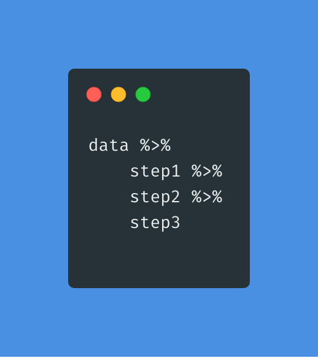

```{r setup, include=FALSE}
knitr::opts_chunk$set(eval = F, 
                      warning = F,
                      message = F)

library(tidyverse)
library(skimr)
library(janitor)
library(here)
library(kableExtra)
library(xaringan)
# devtools::install_github("gadenbuie/countdown")
library(countdown)

```

class: center, middle, inverse, dk-section-title

**Slides adapted from David Keyes (@dgkeyes), inspired by Danielle Navarro (@djnavarro) and Paul Campbell (@paulcampbell91)**

---


## Child Health and Development Studies (CHDS)

.pull-left[
*"Birth weight, date, and gestational period collected as part of the Child Health and Development Studies in 1961 and 1962. Information about the baby's parents — age, education, height, weight, and whether the mother smoked is also recorded."*
]

.pull-right[

]


- Website: 
https://www.stat.berkeley.edu/users/statlabs/papers/sample.pdf

- R package: https://vincentarelbundock.github.io/Rdatasets/doc/mosaicData/Gestation.html


---

class: inverse, center, middle, dk-section-title

# Tidyverse

---

<div class="center">
  
</div>

---


class: center, middle

## The Pipes: %>%
Art by @allison_horst 

---

<div class = "middle">
.pull-left[The pipes! (%>%). They chain together a series of functions]
.pull-right[]
</div>

---

## Tidyverse Syntax

Let's load our database as a dataframe called "data" and **THEN** 
clean the df variable names:

--

```{r eval = F}
data <- read_csv(here("data/chds6162_data.csv")) %>% 
  clean_names()
```

---

**Goal:** Calculate the mean of gestation duration by education levels for mothers younger than 25 years

--

.pull-left[
```{r}
data %>% #<<
  filter(age < 25) %>% 
  group_by(ed) %>%  
  summarize(mean_gestation = mean(gestation, na.rm = TRUE))

```
]

.pull-right[]

---

**Goal:** Calculate the mean of gestation duration by education levels for mothers younger than 25 years

--

.pull-left[
```{r}
data %>% 
  filter(age < 25) %>% #<<
  group_by(ed) %>%  
  summarize(mean_gestation = mean(gestation, na.rm = TRUE))

```
]

.pull-right[]

---

**Goal:** Calculate the mean of gestation duration by education levels for mothers younger than 25 years

--

.pull-left[
```{r}
data %>% 
  filter(age < 25) %>% 
  group_by(ed) %>%  #<<
  summarize(mean_gestation = mean(gestation, na.rm = TRUE)) #<<

```
]

.pull-right[]

---

## Shortcuts

.pull-left[

**Windows**  

*control-shift-M*]

--

.pull-right[

**Mac**

*command-shift-M* ]

---

class:inverse

### Functions we will learn today

.large[
<ol start=1>
  <li> select  
  <li> mutate
  <li> case_when
  <li> filter
  <li> summarize
  <li> group_by
  <li> across
  <li> relocate
]

---

class: inverse, center, middle, dk-section-title

# Goal #1: 

--

.large[
- Create a new variable called **`wt_k`**. This variable will give you information about mom's weight pre-pregnancy(`wt`) in kilos (1 pound = .454 kilos).]

--

.large[
- Select the **`id`**, **`wt`**, and **`wt_k`** columns]

---

```{r}
data %>% 
  mutate(wt_k = wt*.454) %>% #<<
  select(id, wt, wt_k)
```


--


---

.pull-left[
```{r}
data %>% 
  mutate(wt_k = wt*.454) %>%
  select(id, wt, wt_k)  #<<
```

With the function `select` we can select variables (columns) from the larger data frame.]

--

.pull-right[]

---

Too many decimals? Let's fix it:

--

.pull-left[

```{r}
data %>% 
  mutate(wt_k = round((wt*.454),2)) %>% #<<
  select(id, wt, wt_k)  
```
]

--

.pull-right[]


---

class:inverse

### Other ways you can use the function <span style="text-decoration:underline">**`select`**</span>

--

- We can select a range of columns:

```{r}
data %>%
  select(drace:dwt)
```

--

- We can select specific columns and a range:

```{r}
data %>%
  select(id, marital:last_col())
```

- We can drop variables using the -var format. 

--

```{r}
data %>% select(-(marital))  # for 1 column

data %>% select(-c(drace:dwt)) # for a range of columns
```

---

### Other ways you can use the function <span style="text-decoration:underline">**`mutate`**</span>

.pull-left[]

.pull-right[art by @allison_horst]


---

### Other ways you can use the function <span style="text-decoration:underline">**`mutate`**</span>

- Create a **new variable with a specific value**

--

```{r}
data %>%
  mutate(data_decade = "60s")
```

--

- Change an **existing variable** using the help of function **`case_when`**
--
Let's change the `marital` variable from number to their labels

--

```{r}
data %>% 
  mutate(marital = case_when(
    marital == 1 ~ "married",
    marital == 2 ~ "legally separated",
    marital == 3 ~ "divorced",
    marital == 4 ~ "widowed",
    marital == 5 ~ "never married"
  ))
```

---

class:inverse
### Other ways you can use the function <span style="text-decoration:underline">**`filter`**</span>
We can use `<`, `>`, `<=`, and `>=` for numeric data. == equal, != not equal      
.small[art by @allison_horst]


---

class:inverse
### Other ways you can use the function <span style="text-decoration:underline">**`filter`**</span>

--

- To keep rows that do NOT equal something  
Example: filter only those who are **not** divorced (value `3`)

--

```{r}
data %>%
  filter(marital != 3)
```

--

- To keep rows that match a list

--

```{r}
data %>%
  filter(marital %in% c(2, 4,5))
```

--

- To keep rows that match multiple rules

--

```{r}
data %>%
  filter(ed == 5, age %in% 20:30)
```

---

### Functions we have learned so far
```{r include=FALSE}
#devtools::install_github("hadley/emo")
library(emo)
```

.large[
<ol start=1>
  <li> select `r emo::ji("check")`
  <li> mutate `r emo::ji("check")`
  <li> case_when `r emo::ji("check")`
  <li> filter `r emo::ji("check")`
  <li> summarize
  <li> group_by
  <li> across
  <li> relocate
]

---

class: inverse, center, middle, dk-section-title

# Goal #2: 

--

.large[
- Calculate some descriptives for the gestation variable:       
mean, sd, min, max]

--

.large[
- For teen moms by age group]

---

With `summarize`, as the name implies, you will get a summary of your dataset.

--

```{r}
data %>%
  filter(age < 20) %>%
  group_by(age) %>%
  summarize(mean_gestation_length = round(mean(gestation, na.rm = TRUE),2),
            sd_gestation_length = round(sd(gestation, na.rm = TRUE),2),
            min_gestation_length = min(gestation, na.rm = TRUE),
            max_gestation_length = max(gestation, na.rm = TRUE))
```

--


--

- Any guess why is there an NA for sd?

---

```{r}
data %>%
  filter(age < 20) %>%
  group_by(age) %>%
  count()
```


---

class:inverse

### Other ways you can use the function <span style="text-decoration:underline">**`group_by`**</span>
.small[art by @allison_horst]


---

class:inverse

- Group by multiple variables

```{r}
data %>%
  filter(age < 20) %>%
  group_by(age, ed) %>%
  summarize(mean_gestation_length = round(mean(gestation, na.rm = TRUE),2),
            sd_gestation_length = round(sd(gestation, na.rm = TRUE),2),
            min_gestation_length = min(gestation, na.rm = TRUE),
            max_gestation_length = max(gestation, na.rm = TRUE))
```

--


---

class: inverse, center, middle, dk-section-title

# Goal #3: 

--

.large[
- Calculate means for multiple variables (columns) by smoking habits]

--

.large[
- Create a dataframe with our customized order: (smoke,mom age, dad age, gestation)]

---

- Let's use the function **`across`**
```{r}
data %>% 
  drop_na(smoke) %>% # didn't want the mean of those with NA in the smoke var
  group_by(smoke) %>%
  summarize(across(c(gestation,age,dage),mean,na.rm = TRUE))
```

--


---

```{r}
data %>% 
  drop_na(smoke) %>% # didn't want the mean of those with NA in the smoke var
  group_by(smoke) %>%
  summarize(across(c(gestation,age,dage),mean,na.rm = TRUE)) %>%
    relocate (gestation, .after = last_col()) #<<

```

--


---

- Save dataframe as "data_to_save"
```{r}
data_to_save <- data %>% #<<
  drop_na(smoke) %>% # didn't want the mean of those with NA in the smoke var
  group_by(smoke) %>%
  summarize(across(c(gestation,age,dage),mean,na.rm = TRUE)) %>%
    relocate (gestation, .after = last_col())

```

--

- Export csv

```{r}
write_csv(data_to_save, "exports/example_to_export.csv") #<<
```

---

### Functions we have learned so far
```{r include=FALSE}
#devtools::install_github("hadley/emo")
library(emo)
```

.large[
<ol start=1>
  <li> select `r emo::ji("check")`
  <li> mutate `r emo::ji("check")`
  <li> case_when `r emo::ji("check")`
  <li> filter `r emo::ji("check")`
  <li> summarize `r emo::ji("check")`
  <li> group_by `r emo::ji("check")`
  <li> across `r emo::ji("check")`
  <li> relocate `r emo::ji("check")`
]

---

class:inverse

### Your Turn
1. Open the 03-data-wrangling-exercises.Rmd file
1. Load the `tidyverse` package
1. Import the Child Health and Development Studies dataset: **`data/chds6162_data.csv`** to a data frame called **`data`**
1. Wrangling time:
  1. Use **`filter`** to only include those w/ age younger than 40
  2. Use **`mutate`** to transform the **`gestation`** var into weeks & to create a new column **`age_group`** with codes as "20s", "30s", & so on.
  3. Use **`summarise`** to calculate a new var called **`mean_gestation_w`** by moms' **`age_group`** & **`ed`**
  4. Assign it to a new data frame called **`mothers_below40`**
  5. Export it as a csv!

**Bonus:**     
Once you have that data frame move the columns     
around using **"relocate"**

`r countdown::countdown(minutes = 10)`

---

## Solution

```{r}
range(data$age,na.rm = TRUE) 

mothers_below30 <- data %>% 
    filter(age < 40) %>% 
    mutate(gestation_w = gestation/7,
            age_group = case_when(
              age %in% 10:19 ~ "10s",
              age %in% 20:29 ~ "20s",
              age %in% 30:39 ~ "30s"
              )) %>%
  group_by(age_group,ed) %>% 
  summarize(mean_gestation_w = mean(gestation_w,na.rm = TRUE))

mothers_below30

write_csv(mothers_below30,"exports/moms_under30.csv")
```

